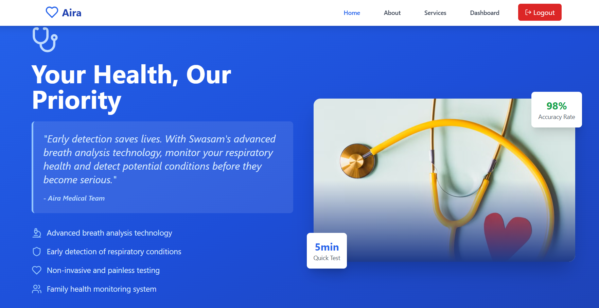
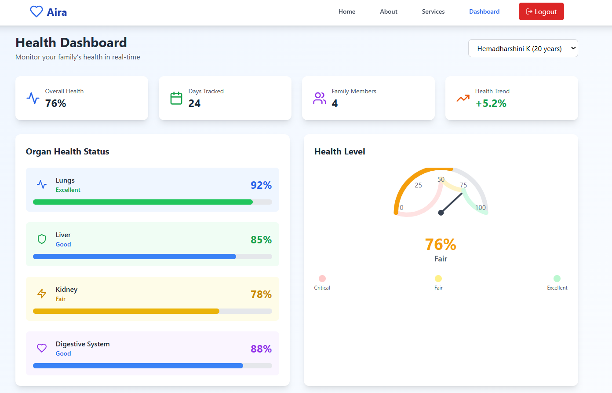

<!--
  Replace <<GITHUB_USERNAME>>, <<REPO_NAME>>, <<SCREENSHOT_URL>> before publishing.
-->
<div align="center">

# 🩺 AIRA
### AI-Powered Respiratory & Air-Quality Health Assistant


</div>

## 📖 Overview
AIRA is a portable health monitoring system that detects volatile organic compounds (VOCs) in the air using MQ gas sensors on a Raspberry Pi/Arduino, paired with a machine learning pipeline and a real-time family health dashboard.

## 🔍 Problem Statement
Indoor and ambient air quality directly affects respiratory health, but most households have no low-cost, real-time way to monitor VOC exposure or detect early warning patterns — especially for family members with respiratory sensitivities. AIRA puts that capability into a portable, affordable device.

## ✨ Key Features
- Real-time VOC sensing via MQ gas sensors on Raspberry Pi/Arduino
- ML model (TensorFlow) trained to detect abnormal patterns in sensor readings
- AI assistant that interprets readings and surfaces plain-language health insights
- Real-time family health dashboard built with React and Firebase
- Edge-to-cloud pipeline: sensor hardware → processing → live dashboard

## 🧱 Tech Stack
| Layer | Technology |
|---|---|
| Hardware | Raspberry Pi / Arduino, MQ Gas Sensors |
| ML | TensorFlow |
| Backend | Flask |
| Frontend | React |
| Database / Realtime | Firebase |

## 🔁 How It Works
1. MQ gas sensors continuously sample air quality (VOC levels) via the Raspberry Pi/Arduino.
2. Readings are sent to a Flask backend, where a TensorFlow model checks for abnormal patterns.
3. Firebase stores readings in real time and syncs them to the dashboard.
4. Family members view live air-quality trends and get AI-assistant explanations on the React dashboard.

## 🌱 Impact
- Makes VOC/air-quality monitoring accessible at home, not just in labs or hospitals.
- Gives families early warning on air-quality issues before symptoms appear.
- Portable design means it isn't tied to one room or one fixed location.

## 🚀 Getting Started

### Prerequisites
- Raspberry Pi / Arduino with MQ sensor setup
- Python ≥ 3.9, Node.js ≥ 18
- Firebase project credentials

### Installation
```bash
git clone https://github.com/hemadharshinikk.git
cd <<REPO_NAME>>

# Backend / ML service
cd backend
pip install -r requirements.txt
python app.py

# Frontend dashboard
cd ../frontend
npm install
npm start
```

## 📸 Screenshots

**Home**


**Login**


**Dashboard**


## 🔮 Roadmap
- [ ] Support additional gas sensor types beyond MQ series
- [ ] Push notification alerts for abnormal readings
- [ ] Multi-device support for larger families

## 🤝 Contributing
Contributions and suggestions are welcome via [issues](https://github.com/hemadharshinikk/AIRA/issues).

## 📄 License
This project is licensed under the MIT License.
